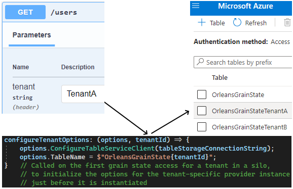
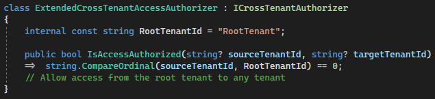

# Orleans.Multitenant
Secure, flexible tenant separation for Microsoft Orleans 4

- **Separate storage** per tenant in any Orleans storage provider, using your own logic:<br />
  
- **Separate communication** across tenants for grain calls and streams, or use your own logic to allow specific access between tenants:<br /> 
  <br />

- **Choose where to use** - for part or all of your application; combine regular stream/storage providers with multitenant ones, use tenant-specific grains/streams and tenant unaware ones. Want to add multitenant storage to an existing application? You can bring along existing grain state in the null tenant. Or add a multitenant storage provider and keep the existing non-multitenant provider as well

- **Secure** against development mistakes: unauthorized access to a tenant specific grain or stream throws an `UnauthorizedException`, and using a non-tenant aware API on a tenant aware stream is blocked and logged.

Scope and limitations:
- Tenant id's are part of the key for a `GrainId` or `StreamId` and can be any string; the same goes for keys within a tenant. The creation and lifecycle management of tenant id's is in the application domain; as far as Orleans.Multitenant is concerned, tenants are **virtual** just like grains and streams - so conceptually all possible tenant id's always exist

- Orleans.Multitenant guards against unauthorized access from within grains that have a GrainId, since only there a tenant-specific context exists (the grain id contains the tenant id). Guarding against unauthorized tenant access from outside a grain (e.g. when using a cluster client in an ASP.NET controller, or in a stateless worker grain or a grain service) is in the domain of the application developer, since what constitutes a tenant context there is application specific

- Only `IGrainWithStringKey` grains can be tenant specific

## Features
All multitenant features can be independenty enabled and configured at silo startup, with the `ISiloBuilder` `AddMultitenant*` extension methods.
See the inline documentation for more details on how to use the API's that are mentioned in this readme. All the public API's come with full inline documentation

### Add multitenant storage
To add tenant storage separation to any Orleans storage provider, use `AddMultitenantGrainStorage` and `AddMultitenantGrainStorageAsDefault` on an `ISiloBuilder` or `IServiceCollection`:

```csharp 
siloBuilder
.AddMultitenantGrainStorageAsDefault<AzureTableGrainStorage, AzureTableStorageOptions, AzureTableGrainStorageOptionsValidator>(
    (silo, name) => silo.AddAzureTableGrainStorage(name, options =>
        options.ConfigureTableServiceClient(tableStorageConnectionString)),
        // Called during silo startup, to ensure that any common dependencies
        // needed for tenant-specific provider instances are initialized

    configureTenantOptions: (options, tenantId) => {
        options.ConfigureTableServiceClient(tableStorageConnectionString);
        options.TableName = $"OrleansGrainState{tenantId}";
    }   // Called on the first grain state access for a tenant in a silo,
        // to initialize the options for the tenant-specific provider instance
        // just before it is instantiated
 )
```

### Add multitenant streams
To configure a silo to use a specific stream provider type as a named stream provider with tenant separation, use `AddMultitenantStreams`. Any Orleans stream provider can be used:
```csharp
.AddMultitenantStreams(
    "provider_name", (silo, name) => silo
    .AddMemoryStreams<DefaultMemoryMessageBodySerializer>(name)
    .AddMemoryGrainStorage(name)
 )
```
Both implicit and explicit stream subscriptions are supported.

### Add multitenant communication separation
To configure a silo to use tenant separation for grain communication, use `AddMultitenantCommunicationSeparation` . Separation will be enforced for both grain calls and streams (the latter if used together with `AddMultitenantStreams`)

Optionally pass in an `ICrossTenantAuthorizer` factory and/or an `IGrainCallTenantSeparator` factory, to control which tenants are authorized to communicate, and which grain calls require authorization:
```csharp
.AddMultitenantCommunicationSeparation(_ => new CrossTenantAccessAuthorizer())
```
```csharp
class ExtendedCrossTenantAccessAuthorizer : ICrossTenantAuthorizer
{
    internal const string RootTenantId = "RootTenant";

    public bool IsAccessAuthorized(string? sourceTenantId, string? targetTenantId)
    =>  string.CompareOrdinal(sourceTenantId, RootTenantId) == 0;
    // Allow access from the root tenant to any tenant
}
```

By default different tenants are not authorized to communicate, and only calls to `Orleans.*` grain interfaces are exempted from authorization

- An attempt to make an unauthorized grain call causes an `UnauthorizedAccessException` to be thrown. The call does not reach the target grain
- An unauthorized attempt to access a stream provider using `GetTenantStreamProvider` causes an `UnauthorizedAccessException` to be thrown
- An attempt to publish an event to a multitenant stream without using `GetTenantStreamProvider` (i.e. using the Orleans built-in `GetStreamProvider` API) causes the event to be blocked by the stream filter; an error with event Id `TenantUnawareStreamApiUsed` is logged in the silo log (also see `AddMultitenantStreams`)

### Access tenant grains and streams from a tenant grain
- To get a tenant grain factory from an `IAddressable` (i.e. a grain) for the tenant that this grain belongs to, use the `IGrainFactory` extension method `factory.ForTenantOf(grain)`:
  ```csharp
  var myTenantGrain = factory.ForTenantOf(grain).GetGrain<IMyGrain>("key_within_tenant");
  ```
  A tenant grain factory is a very lightweight, allocation-free factory wrapper; it can be stored/cached as desired, but it's overhead is extremely low even without that.

- To access grains that belong to another tenant, use `factory.ForTenant("tenant_id")`:
  ```csharp
  var otherTenantGrain = factory.ForTenant("tenant_id").GetGrain<IMyGrain>("key_within_tenant");
  ```

- To get a tenant stream provider for the tenant that this grain belongs to, use the `Grain` extension method `this.GetTenantStreamProvider("provider_name")`:
  ```csharp
  var myTenantStream = this.GetTenantStreamProvider("provider_name").GetStream<int>("stream_namespace", "stream_key_within_tenant");
  ```
  A tenant stream provider is a very lightweight, allocation-free stream provider wrapper; it can be stored/cached as desired, but it's overhead is extremely low even without that.

- To access streams that belong to another tenant, use the `Grain` extension method `this.GetTenantStreamProvider("provider_name", "tenant_id"):
  ```csharp
  var myTenantStream = this.GetTenantStreamProvider("provider_name", "tenant_id").GetStream<int>("stream_namespace", "stream_key_within_tenant");
  ```

When `AddMultitenantCommunicationSeparation` is used, all of the methods are guarded against unautorized access.

### Access tenant grains and streams outside a tenant grain
Outside a tenant grain (e.g. in a cluster client, a stateless worker grain or a grain service):
- use `factory.ForTenant("tenant id")` to access tenant grains:<br />
  ```csharp
  var tenantGrain = factory.ForTenant("tenant_id").GetGrain<IMyGrain>("key_within_tenant");
  ```

- use the `IClusterClient` extension method `client.GetTenantStreamProvider("provider name", "tenant id") to access tenant streams.<br />
  ```csharp
  var tenantStream = client.GetTenantStreamProvider("provider_name", "tenant_id").GetStream<int>("stream_namespace", "stream_key_within_tenant");
  ```

**Note** that guarding against unauthorized tenant access from outside a grain (e.g. in an ASP.NET controller) is in the domain of the application developer, since what constitutes a tenant context there is application specific.

### Grain/stream key and tenant id
Tenant id's are stored in the key of a tenant specific `GrainId` / `StreamId`. Use these methods when you need to access the individual parts of the key:
```csharp
string? GetTenantId(this IAddressable grain);
string  GetKeyWithinTenant(this IAddressable grain);

string? GetTenantId(this StreamId streamId);
string  GetKeyWithinTenant(this StreamId streamId);
```


